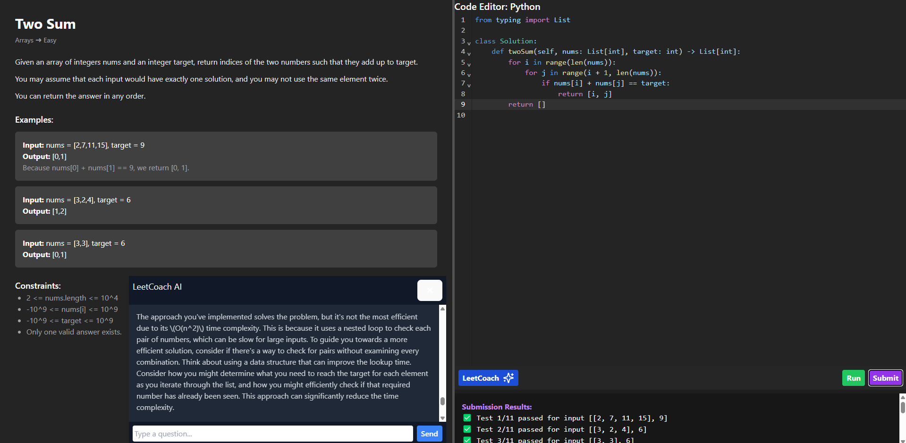

# LeetCoach

LeetCoach is an AI-powered LeetCode-style coding interview prep platform. It allows users to practice real DSA problems, write Python code in a live editor, and receive intelligent feedback from an AI tutor — without ever giving away the solution.

---

## Overview

LeetCoach replicates the experience of solving LeetCode problems and simulates a technical interview environment enhanced by AI tutoring. As you write and submit code, the AI helps you understand the problem, debug issues, and think critically — based on how much effort you've put in.

---

## Features

### Core Capabilities
- Live Python code editor with VS Code-style theme
- Problem statement with real constraints and examples
- Run button for raw code output
- Submit button that runs multiple test cases and gives verdicts
- Responsive two-panel layout (problem ↔ code)
- AI coaching button (LeetCoach) with animated UI

### AI Tutor (GPT-4o-mini Model)
- Integrated with OpenAI API using the `gpt-4o-mini` model
- Tutor follows a progressive help model:
  - Strict if you haven’t tried much
  - Offers hints if you’re stuck
  - Helps debug if you’ve written substantial code
- Will **never provide direct solutions**
- Focuses on explaining time/space complexity, edge cases, and misconceptions

---

## Example Problem: Two Sum

This is an example of a **Two Sum** problem where the AI provides **feedback on the user's code**.

### Screenshot: AI-assisted coding and feedback

*Caption: Example showing the Two Sum problem, code editor, and AI feedback.*

### Problem Description
Given an array of integers, **nums**, and a target integer, **target**, return the indices of the two numbers such that they add up to the target. You may assume that each input would have exactly one solution, and you may not use the same element twice.

### Example Code (Wrong Approach — Brute Force):

Here’s a brute force solution that is **close but not optimal**:

```python
def two_sum(nums, target):
    for i in range(len(nums)):
        for j in range(i + 1, len(nums)):
            if nums[i] + nums[j] == target:
                return [i, j]
    return []
```

### Why This Approach Is Incorrect:

- **Time Complexity**: The above approach has a **time complexity of O(n²)**, which is inefficient for large inputs. It checks every pair of numbers in the array, resulting in a quadratic number of operations.
- **Optimal Solution**: The **optimal solution** for this problem uses a **hash map** to reduce the time complexity to **O(n)** by checking for the complement of each number in a single pass.

### AI's Feedback:

The AI coaching assistant in LeetCoach analyzes the user's code and provides helpful hints and suggestions. For this code, the AI would point out that the time complexity is suboptimal and recommend using a hash map for a more efficient solution.

### Optimal Solution Using a Hash Map:

```python
def two_sum(nums, target):
    num_map = {}
    for i, num in enumerate(nums):
        complement = target - num
        if complement in num_map:
            return [num_map[complement], i]
        num_map[num] = i
    return []
```

---

## Future Enhancements

- **More Problems**: Expand problem set by difficulty and topic.
- **Algorithms Roadmap**: A detailed algorithms roadmap that introduces each topic in a friendly way.
- **Sign-in Mode**: User authentication for progress tracking and motivational rewards.

---

## License

This project is for educational use only. All rights reserved.